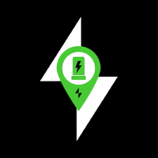

<h1 align="center">
  
</h1>

<p align="center">
  
</p>


## 💻 Project

An example of Mobile Application to find, pay and make a reservation of ev chargers.

# Team

- Here must contain the names of everyone in the team, at the moment that
  project is created
  - React Native Engineer: Alexandre Marques

# To Navigation

- @react-navigation/native V6.

## Features

- [ ] List Chargers on Map.
- [ ] Detail of Charger.

## ✨ Technologies

- [ ] Bare workflow project.
- [ ] React Navigation V6.
- [ ] Tamagui.
- [ ] Expo.
- [ ] TanStack React Query

## Running the project

### Run Expo Environment

```
npx expo start / yarn start
```

### Run Native Development

**Install dependencies**

```
npm / yarn
```

**Install IOS Pods**

```
cd ios && pod install
```

**Run IOS**

```
yarn ios
```

**Run Android**

```
yarn android
```

## Running the tests

Use **yarn test** to execute the jest tests.

```cl
yarn test
```

<br />

# Project Structure

```bash
├── assets
│   └── images
├── components
├── hooks
├── navigation
├── screens
├── services
├── styles
    └── theme
        └── default-theme
```

<div align="center">
  <small>Developed By Alexandre Marques - 2024/Jun</small>
</div>
